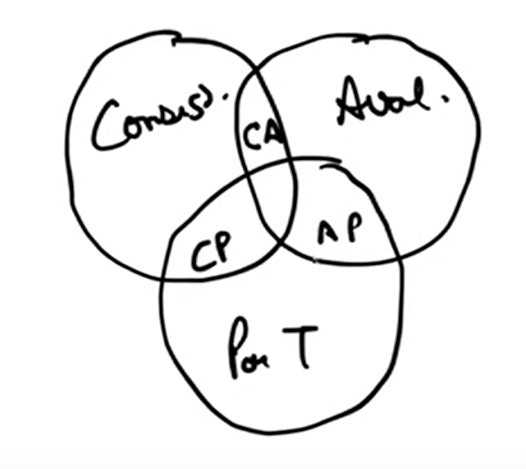
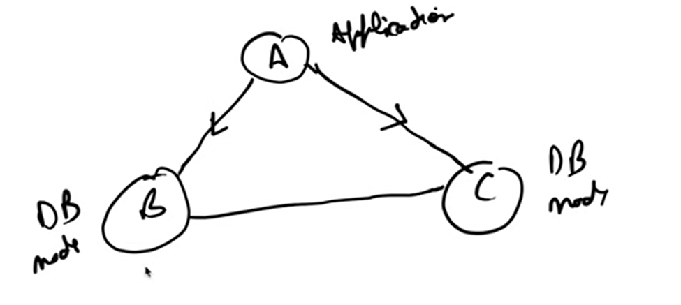

CAP Theorem

Desirable property of distributes systems with replicated data

C - Consistency
A - Availability
P - Partition Tolerance

In any distributed data store, we can only guarantee two of the above mentioned properties at the same time.

so it is like either we can have CP or AP

why it cannot be AC where we have ignored P 

because in distributed system there is always a chance of network failure or break in connection between the nodes in the internal system

Consistency means -

In the above image lets say there are two DB nodes DB1 and DB2
if we are writing some data to DB1 and if the Data is successfully commited to DB1 then the same data should be replicated in DB2
if the user is reading from the DB2 it should return the same data which is written to DB1
if the data is not replicated immediately to DB1 but it took some time then it is called as eventual consistency

Availability means-
I need to get the response for my request whether it is success or failure 
Even if the data is inconsistent I should get the response for my request 

Partition Tolerance means-
It is gurantee that the system should continue to operate despite there is break in connection between in the nodes in the internal system 
and these nodes will serve the requests independently and system still be available to the users 

Below is ChatGPT's explanation

CAP Theorem
A theorem stating that a distributed data store can only guarantee two of the following three properties at the same time:

C - Consistency: Every read request receives the most recent write or an error. In other words, all clients see the same data at the same time, no matter which node they connect to.

A - Availability: Every request to a non-failing node receives a non-error response, without the guarantee that it contains the most recent data.

P - Partition Tolerance: The system continues to operate despite a communication break (network partition) between nodes.

The Real-World Trade-off: CP vs. AP

In any practical distributed system, network failures (partitions) are inevitable. Therefore, Partition Tolerance (P) is not optional. A system must be able to handle these failures. This means the actual trade-off for a distributed system is always between Consistency and Availability.

CP (Consistent and Partition-Tolerant): If a partition occurs, the system will sacrifice availability to maintain consistency. It may return an error or time out requests to prevent clients from reading stale data.

Example: Banking systems, where data accuracy is critical.

AP (Available and Partition-Tolerant): If a partition occurs, the system will sacrifice consistency to remain available. It will respond to requests with the most recent data it has, which might be stale. This often leads to eventual consistency, where the system will resolve inconsistencies after the network partition is fixed.

Example: A social media feed or an e-commerce shopping cart, where being always online is more critical than showing perfectly up-to-date data at all times.

Why Not AC (Available and Consistent)?

A system can only be Available and Consistent if it never has a partition. This is only possible in a single-node system (like a traditional single-instance database) or a system with a perfectly reliable network, which does not exist in the real world. As soon as you distribute the data across a network, you must plan for partitions, forcing you to choose between CP and AP.

