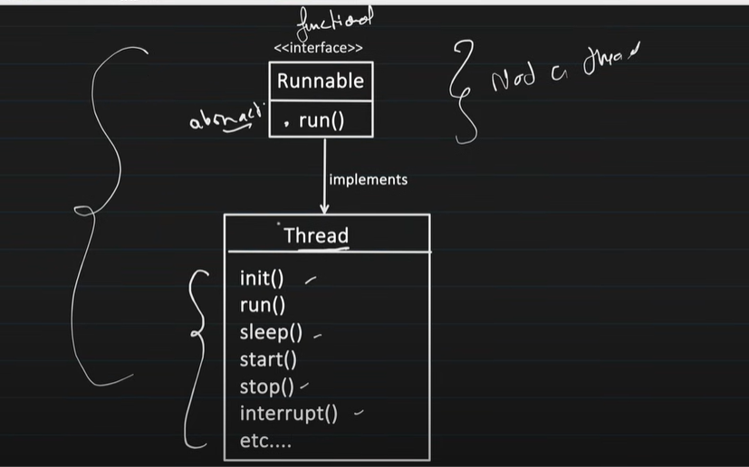
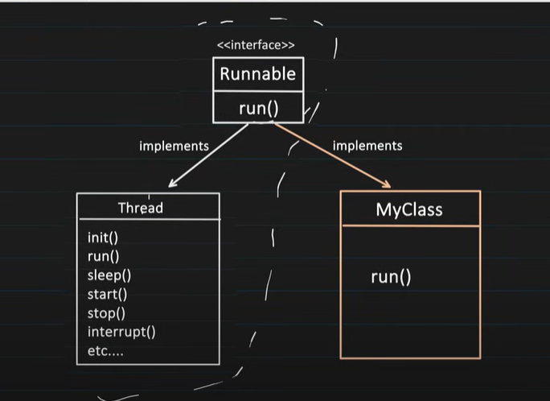
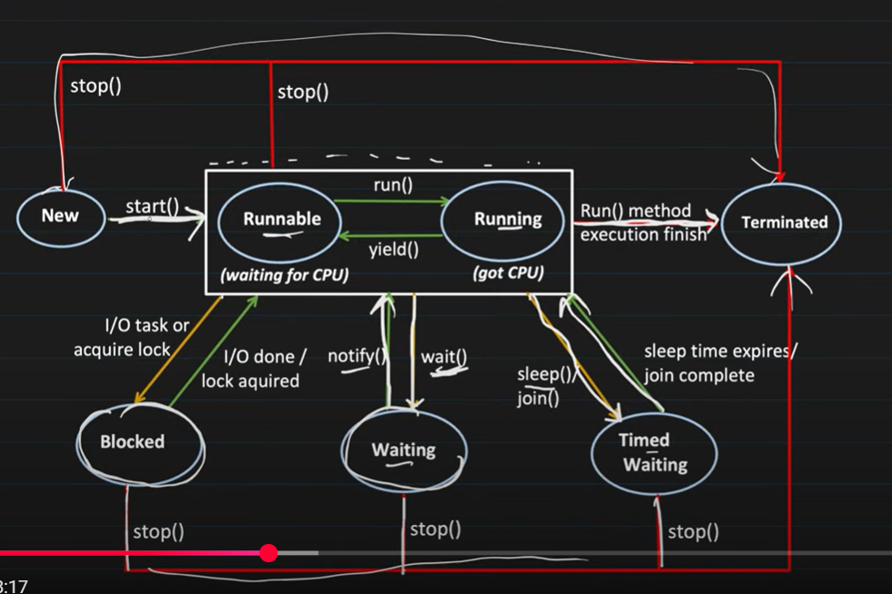

Thread creation --
There are two ways for the thread creation

which are

1. extending the Thread class
2. implementing the Runnable interface

we have two ways to create a thread because

lets say there is one class A it can which already extends from Class parentA ,
so lets say if we want to give the thread power to class A then we need to implement runnable interface
since we cannot inherit from more than one class

so java has provided both the ways for thread creation one is through extending thread class
and second is through implementing through Runnable interface

Even tough Thread Class also implements Runnable Interface

Thread class has lot of methods which takes care of life cycle of thread

Thread class has lot of methods which takes care of life cycle of thread

in General company standard Runnable is used 

